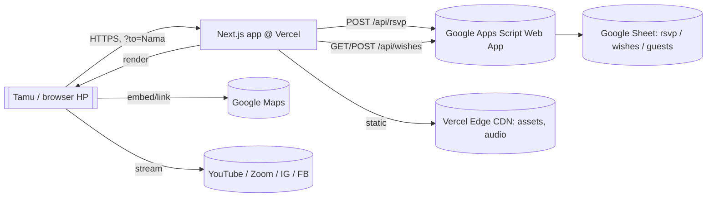
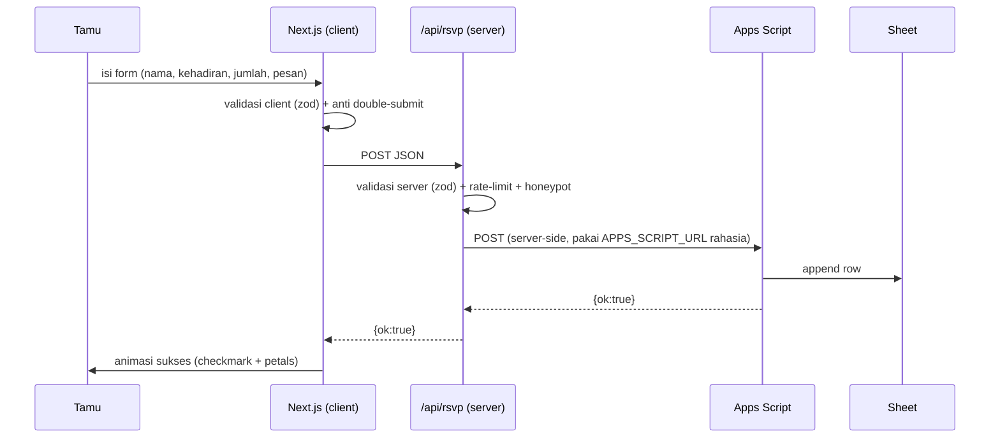

# SPEC 01 — System Architecture

**Status:** authoritative build bible (the "main 8"). Baca berurutan 01→08. Konteks gaya/gerak ada di `docs/08–12`.

Proyek: undangan pernikahan **Bashara & Hanifah** — 22 Agustus 2026, Widuri Restaurant Bandung. One-page, mobile-first, ilustrasi storybook pastel, "hidup bukan kaku".

---

## 1. System context (C4 level-1)



- **Frontend + thin backend** keduanya di Next.js (Vercel). 
- **Persistensi** = Google Sheet via Apps Script Web App (gratis, dikelola mempelai, mudah dibaca). Tidak ada DB sendiri.
- **Tidak ada auth user**. Personalisasi via query param `?to=`. Konten publik.

---

## 2. Tech stack & alasan

| Lapis | Pilihan | Alasan |
| :-- | :-- | :-- |
| Framework | **Next.js (App Router, TS)** | SSR/SSG + API routes dalam satu repo; deploy mulus di Vercel |
| Bahasa | **TypeScript** | Kontrak data aman (RSVP, config) |
| Styling | **Tailwind CSS** + token (`lib/motionTokens.ts`, CSS vars palet) | cepat, konsisten, kecil |
| Animasi | **GSAP + ScrollTrigger + MotionPath**, **Lenis** | gerak halus, scrub, path; lihat `docs/08–12` |
| Gambar | **next/image** (webp/png) | optimisasi & lazy otomatis |
| Font | **next/font** (serif heading + sans body, self-host) | no layout shift |
| Data | **Google Sheet + Apps Script Web App** | gratis, mudah diedit non-teknis |
| Hosting | **Vercel** | native Next, edge CDN, preview deploy |
| Analytics (opsional) | Vercel Analytics | ringan, privasi |

Tidak dipakai: DB eksternal, CMS, state lib berat (Redux), video, 3D.

---

## 3. Rendering strategy

| Bagian | Mode | Catatan |
| :-- | :-- | :-- |
| Shell halaman `/` | **Static (SSG)** | HTML statis, cepat; konten dari `lib/config.ts` |
| Nama tamu (`?to=`) | **Client** | dibaca di client dari query → hindari SSR cache per-tamu; SEO tak butuh nama |
| Motion | **Client only** | semua GSAP/Lenis di `useEffect`, SSR-safe (guard `typeof window`) |
| Wishes list | **Client fetch** (SWR-style, cache pendek) | dari `/api/wishes` |
| RSVP submit | **API route** | server menyembunyikan URL Apps Script |
| OG/metadata | **Static** | hero-card sebagai OG image |

> Karena `?to=` di client, tiap link tamu pakai HTML statis yang sama (cache CDN penuh) lalu di-hidrasi nama. Cepat & murah.

---

## 4. End-to-end data flow (RSVP)



Wishes: pola sama (POST), plus GET untuk render list publik.

---

## 5. Environments & config

| Env | URL | Data |
| :-- | :-- | :-- |
| Local dev | `localhost:3000` | Apps Script "test" deployment |
| Preview (Vercel) | auto per-PR | Apps Script test |
| Production | domain final | Apps Script prod |

Secrets (Vercel env, **server-only**, tanpa `NEXT_PUBLIC_`):
- `APPS_SCRIPT_URL` — endpoint web app
- `APPS_SCRIPT_TOKEN` — shared secret dikirim di body (validasi di Apps Script)
Public env (boleh `NEXT_PUBLIC_`): `NEXT_PUBLIC_MAPS_URL`, `NEXT_PUBLIC_SITE_URL`.

---

## 6. Non-functional requirements (NFR)

| Kategori | Target |
| :-- | :-- |
| Performance | LCP < 2.5s (3G mid), CLS < 0.05, Lighthouse mobile ≥ 90 perf & a11y |
| Bundle | JS < ~150KB gz (incl GSAP+Lenis); hero transfer < 600KB |
| Motion | 60fps mid-tier; smart fallback (`docs/08 §7`) |
| Aksesibilitas | prefers-reduced-motion dihormati; kontras teks AA; alt text |
| Privasi | tanpa tracking invasif; data RSVP hanya ke Sheet mempelai |
| Resiliensi | gagal Apps Script → pesan ramah + retry; situs tetap jalan tanpa JS-heavy (konten inti terbaca) |
| Kompatibilitas | iOS Safari 15+, Chrome Android; potato phone (tier LOW) |

---

## 7. Authoritative directory structure
(rinci di SPEC 02 §; ringkas di sini)
```
app/ (page.tsx, layout.tsx, api/{rsvp,wishes}/route.ts)
components/ (motion/, hero/, sections/, ui/, primitives/)
lib/ (config.ts, motionTokens.ts, guest.ts, sheets.ts, validation.ts, ics.ts)
public/assets/ (mirror of /assets minus _source)
docs/ (01–12 + spec/01–08)
```

---

## 8. Risiko & mitigasi
| Risiko | Mitigasi |
| :-- | :-- |
| Autoplay audio diblokir | start hanya setelah tap Gate (`docs/10 §2`) |
| Gyro ditolak iOS | fallback scroll-only + auto-drift (`docs/08 §5`) |
| Apps Script kuota/lambat | rate-limit, debounce, pesan retry, queue ringan |
| Spam wishes/RSVP | honeypot + rate-limit + moderasi opsional |
| HP lemah lag | tier LOW/REDUCED mematikan efek berat |
| Aset berat | next/image, webp, trim (sudah), preload selektif |

Lanjut: **SPEC 02 — Frontend Architecture**.
