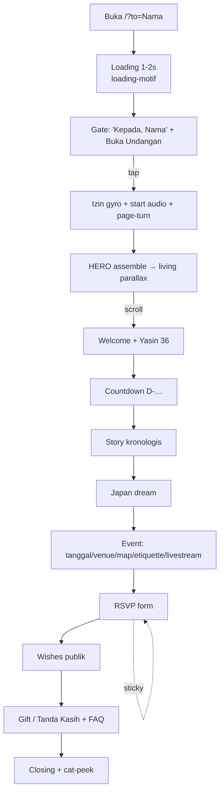
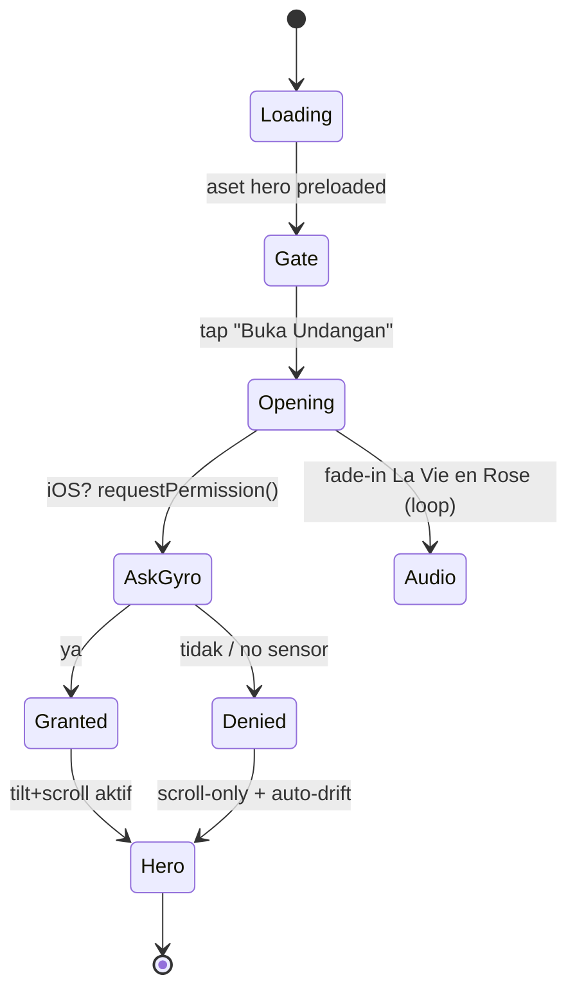
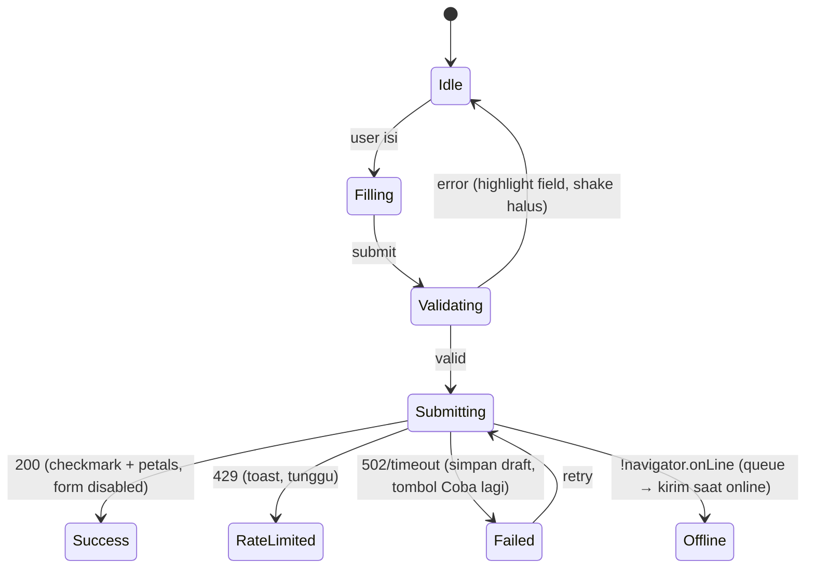
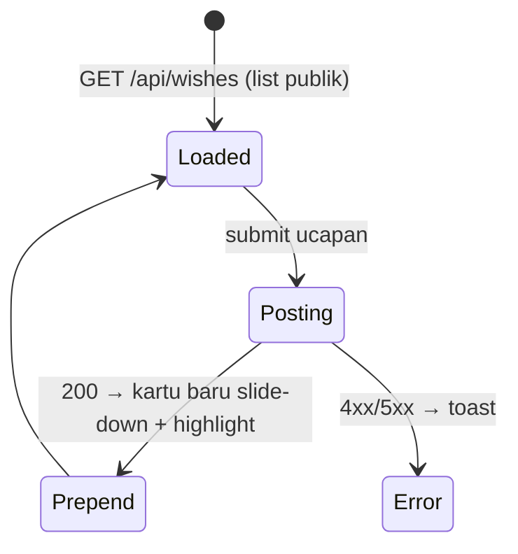

# SPEC 05 — User Flows

Alur tamu end-to-end + state machine + edge case. Arc: gate → hero → welcome → countdown → story → japan → event → rsvp → wishes → gift → closing (`docs/02`, `docs/10`).

---

## 1. Happy path (tamu buka dari link personal)

Durasi target ± 1 menit; user bebas scroll cepat ke RSVP/peta (sticky button + smooth scrollTo).

---

## 2. Gate & permission flow (kritis)

Catatan:
- Permission gyro & audio **harus** dipicu oleh gesture tap (kebijakan browser). Keduanya di handler tap Gate.
- Jika user reload setelah masuk: lewati animasi gate panjang (simpan `entered` di sessionStorage) → langsung hero (assemble cepat). Audio tetap butuh 1 tap (browser) → tampilkan toggle "🔊".

---

## 3. RSVP flow + states

Field & aturan (`SPEC 04`): nama, kehadiran (Hadir/Tidak/Diusahakan), jumlah (1–4, muncul hanya jika Hadir), pesan opsional. Deadline **D-7** tampil jelas; setelah lewat → form bisa dikunci (opsional) dgn pesan lembut.

---

## 4. Wishes flow

- List publik (semua bisa baca). Pagination/`limit` + "muat lebih". Sanitasi & escape teks.

---

## 5. Audio flow
- Default **OFF**. Start saat tap Gate (fade-in vol→~0.5, loop).
- `AudioToggle` selalu ada (pojok), state ke localStorage. Hormati jika user mute.
- Pause saat tab hidden (opsional) untuk hemat.

---

## 6. Edge cases (wajib ditangani)

| Kasus | Perilaku |
| :-- | :-- |
| Tanpa `?to=` | Gate sapa generik "Bapak/Ibu/Saudara/i" |
| `?to=` aneh/encoding rusak | fallback tampilkan raw / generik, tidak error |
| Reload tengah jalan | skip gate panjang (sessionStorage `entered`) |
| Gyro ditolak / desktop | scroll-only + auto-drift; tidak ada prompt berulang |
| Autoplay diblokir | audio nyala via toggle; tidak memaksa |
| Offline saat submit | queue + kirim saat online; pesan jelas |
| Apps Script error | toast + draft tersimpan + retry |
| JS mati / crash motion | konten inti tetap terbaca (progressive enhancement); fallback flat hero |
| prefers-reduced-motion | semua gerak → fade lembut (`docs/08 §7`) |
| HP lemah (tier LOW) | efek berat mati otomatis |
| Deadline RSVP lewat | form locked + pesan; wishes & info tetap jalan |
| Layar besar/desktop | layout kartu terpusat; hero full-bleed |

---

## 7. Loading / empty / error states (UI)
- **Loading awal**: `loading-motif` 1–2s (bukan spinner kaku).
- **Wishes kosong**: ilustrasi kecil + "Jadilah yang pertama memberi ucapan 💌".
- **Wishes loading**: skeleton kartu lembut (shimmer halus).
- **Submit sukses**: micro-perayaan (checkmark draw + petals).
- **Error**: toast `aria-live`, nada ramah Bahasa Indonesia.

---

## 8. Navigation utilities
- Tanpa nav bar terlihat (editorial, dipandu scroll).
- **Sticky RSVP** (mobile): muncul setelah hero, sembunyi di section RSVP, breathing.
- **ScrollTop** halus muncul setelah scroll jauh.
- Smooth scroll via Lenis `scrollTo("#rsvp" / "#lokasi")`.

---

## 9. Flow checklist
- [ ] Gate→permission→audio→hero rapi
- [ ] reload skip-gate
- [ ] RSVP state machine lengkap (incl offline/retry)
- [ ] wishes prepend + empty/loading
- [ ] semua edge case di tabel §6 tertangani
- [ ] reduced-motion & tier path teruji

Lanjut: **SPEC 06 — Motion Integration**.
