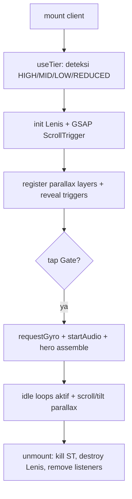

# SPEC 06 — Motion Integration

Jembatan teknis antara bahasa gerak (`docs/08–12`) dan kode. Fokus: lifecycle, kontrak hook, SSR-safety, cleanup, perf. Tujuan tetap: **hidup, bukan kaku**.

---

## 1. Runtime lifecycle



Urutan aman: tier dulu → baru bikin animasi sesuai tier (jangan bikin lalu matikan).

---

## 2. Library setup (sekali, di provider)

```ts
// components/motion/Lenis.tsx
const lenis = new Lenis({ lerp: 0.09, smoothWheel:true, syncTouch:true });
function raf(t:number){ lenis.raf(t); ScrollTrigger.update(); requestAnimationFrame(raf); }
requestAnimationFrame(raf);
// GSAP
gsap.registerPlugin(ScrollTrigger, MotionPathPlugin);
ScrollTrigger.config({ ignoreMobileResize:true });
```
- **Satu RAF global** (Lenis + ScrollTrigger + parallax + particles semua ikut loop ini bila mungkin).
- `ScrollTrigger.refresh()` setelah font/gambar hero load (cegah posisi salah).

---

## 3. MotionProvider (context)

```ts
type Tier = "HIGH"|"MID"|"LOW"|"REDUCED";
interface MotionCtx {
  tier: Tier; reduced: boolean;
  gyro: {x:number;y:number};       // ter-lerp, -1..1
  gyroEnabled: boolean;
  enableGyro: () => Promise<void>;  // dipanggil saat tap Gate (iOS permission)
}
```
- SSR default `tier:"MID", reduced:false, gyro:{0,0}` → diperbarui di `useEffect` (client). Komponen animasi **selalu** baca `useMotion()` sebelum memutuskan.
- Helper: `motionOn(feature, tier)` → boolean dari tabel `docs/08 §7`.

---

## 4. Kontrak hook

```ts
// useTier(): Tier  — deteksi sekali (SPEC 01 §; docs/08 §7)
// useGyro(): { gyro, enabled, enable }  — DeviceOrientation + permission + lerp(0.08); nol bila REDUCED/denied
// useParallax(layers: {ref, factorX, factorY, axis}[]) : void
//   gabung scrollProgress(ScrollTrigger) + gyro → set translate3d; pause off-screen; no-op REDUCED
// useReveal(ref, { y?, delay?, stagger?, once? }) : void
//   ScrollTrigger start "top 80%"; entrance opacity+y (ease.enter); REDUCED → opacity-only
// useBreathing(ref, { amp, dur, seed }) ; useSway(ref,{deg,dur,pivot,seed})
//   idle loops; fase acak by seed; auto-pause off-screen; no-op REDUCED
```
Semua hook **idempotent & cleanup**: simpan instance GSAP/ST di ref, `kill()` di cleanup `useEffect`.

---

## 5. Anti-kaku enforcement (di kode)

- **Stagger & overlap** lewat satu timeline per grup (`gsap.timeline()`), pakai `-=` untuk overlap, `stagger` untuk anak. Jangan `.to()` terpisah tanpa koordinasi.
- **Randomisasi**: util `seeded(seed)` → durasi/delay/amplitudo `±%`. Tiap kucing/petal punya seed beda → tak sinkron.
- **Settle**: entrance pakai `ease.settle` (back.out 1.3) ringan; idle pakai `ease.float` (sine).
- **Selalu ada idle**: setiap aset penting wajib `useBreathing`/`useSway` (lint manual via checklist `docs/12`).
- **Transform/opacity only**; set `will-change:transform` saat aktif, hapus saat selesai.

---

## 6. Hero assemble (teknis) — `docs/09`

```ts
const tl = gsap.timeline({ defaults:{ ease: ease.enter }, onComplete: startIdle });
tl.from(sky,    { autoAlpha:0, scale:1.06, duration:1.0 })
  .from(meadow, { autoAlpha:0, y:20, duration:0.9 }, "-=0.85")
  .from(couple, { autoAlpha:0, y:40, scale:0.96, duration:0.8, ease: ease.settle }, "-=0.6")
  .from(catRefs,{ autoAlpha:0, y:30, scale:0.9, duration:0.7, ease: ease.settle, stagger: stagger.base }, "-=0.45")
  .from(florals,{ autoAlpha:0, scale:1.08, duration:0.7, stagger: stagger.tight }, "-=0.4")
  .add(startDoves).add(startButterflies).add(startParticles)
  .from(textLines,{ autoAlpha:0, y:12, duration:0.6, stagger: stagger.base }, "-=0.5");
```
`startIdle()` memasang breathing/sway/parallax. Untuk LOW → ganti timeline dgn fade cepat; REDUCED → langsung tampil + fade.

---

## 7. SSR-safety & hydration
- Semua kode GSAP/Lenis/DeviceOrientation di `useEffect` (client). Guard `if (typeof window==="undefined") return`.
- Komponen animasi = `"use client"`. Konten teks tetap di markup (terindeks & terbaca tanpa JS).
- Hindari mismatch: nilai awal animasi diset via CSS (mis. `opacity:0` hanya bila JS aktif → pakai class `js-anim` ditambah setelah mount, supaya no-JS tetap tampil).

---

## 8. Particles & paths (perf) — `docs/12`
- Petals/pollen: satu `<canvas>` + RAF; count per tier; pause saat `document.hidden` & off-screen.
- Doves/butterflies: GSAP MotionPath; transform-only; varied per loop; pause off-screen.
- Total elemen beranimasi simultan di viewport ≤ ~18 (`docs/08 §8`).

---

## 9. Instrumentation & QA gerak
- Dev overlay (toggle `?debug=motion`): tampil tier aktif, fps, jumlah ST, jumlah particle.
- Uji: HP low-end nyata (tier LOW), iOS (gyro permission), `prefers-reduced-motion` ON, koneksi 3G throttle.
- Pastikan tidak ada layout shift dari animasi (transform only).

---

## 10. Motion-integration checklist
- [ ] Provider: tier + gyro + Lenis + GSAP register
- [ ] satu RAF global; ScrollTrigger.refresh setelah aset hero
- [ ] hooks (parallax/reveal/breathing/sway/gyro) + cleanup kill
- [ ] hero timeline + idle handoff + tier variants
- [ ] particles/doves/butterflies pause off-screen & per-tier
- [ ] SSR-safe, no-JS readable, no CLS
- [ ] debug overlay + device matrix tested

Lanjut: **SPEC 07 — Content, i18n & SEO**.
